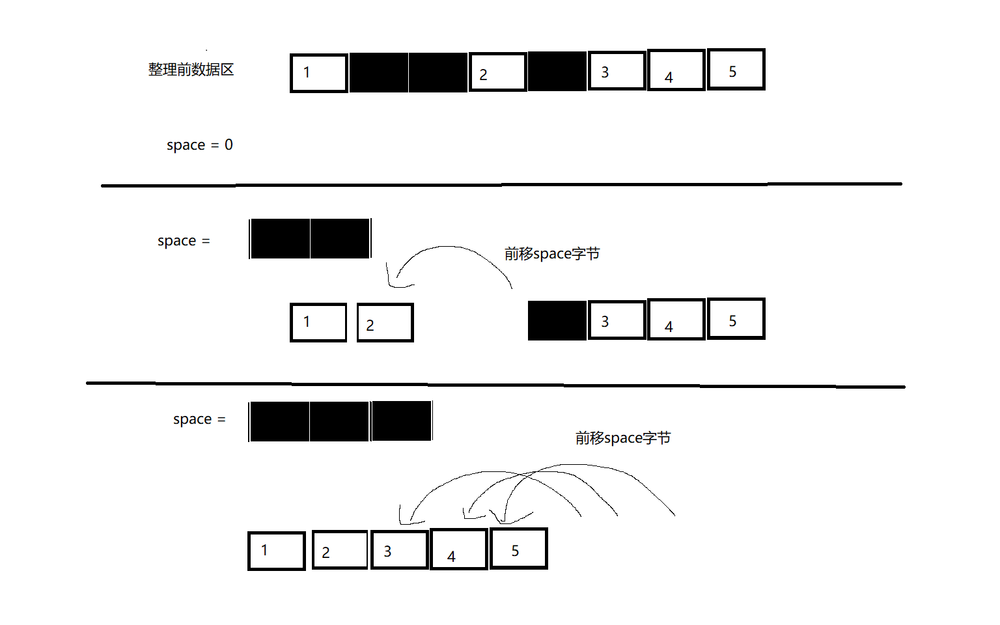

# 关于基于文件的持久化集合实现中的文件结构  
list/set  
文件分为索引区 数据区
索引区负责记录每个数据的数据区偏移量。  
一个索引占据4个字节表示数据所在的***数据区偏移量***    
索引区大小等于(size+2)*4 
## 索引区  
四个字节记录索引区索引容量cap 单位个  
四个字节记录元素数量size  
之后开始 每4个字节为一个索引  
索引区大小=(2+cap)*4
当size == cap时 需要进行索引区扩容  
#### 扩容步骤: 
1 计算出新的cap 内存中记录新旧cap， 修改文件中的cap值
2 把数据区整体后挪动(新cap-旧cap)*4
***数据区偏移量***指的是 从数据区域开始的偏移量 而不是相对于文件的偏移量

在读完索引区后 就开始进入到数据区  
## 数据区
每个数据的前9个字节不记录数据本身， 
其中，第1个字节表示数据是否有效(delete标志位 0代表有效),  
4个字节hashcode   
然后4个字节表示数据的大小  
 
后面跟着是数据  
9字节+数据本身称为数据块

##插入操作
1: 可能的索引区扩容 
2: size+1
3: 根据插入位置修改索引区 可能要把插入下标后的索引后挪一位再插入  
4: 计算后挪字节数, 后挪字节数等于(数据本身字节数+9(1delete标志 4hashcode 4数据字节数)  )
5: 插入点后的索引增加后挪字节数 目的是修正记录的偏移量
6: 数据区开始后挪以腾出位置

## 删除操作
1: size-1
2: 根据索引，或者hashcode+数据逐字节对比找到数据 把delete标志位设置为1
3: 删除索引  

## 查找元素:  
1: 根据hashcode遍历 找到hashcode相同的且delete标志不为1的
2: 逐字节比对数据部分 如果通过则返回结果 否则继续查找 

## 整理文件:   用于减少操作后浪费的空间  
数据块:9字节+数据本身  
1: 设置变量 space 代表前移的字节数 表示该数据块之前的无效数据块所占据的字节数  
2: 读数据块 先读9个字节 判断一下是否删除 以及这条数据占了几个字节  
3: 如果该条数据已被删除  space+=数据块字节数  
4: 遍历到一个未被删除的数据 此时把该条数据前挪space个字节，同时修改索引值。

详见   

