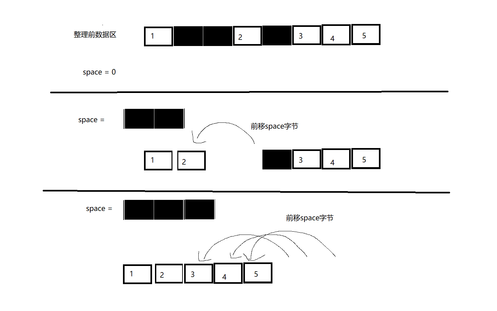
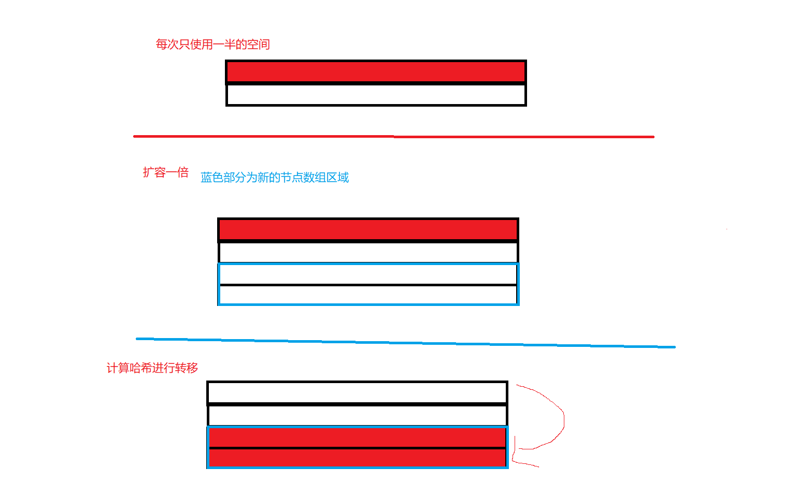

# 关于基于文件的持久化集合实现中的文件结构  
list/set  
文件分为索引区 数据区
索引区负责记录每个数据的数据区偏移量。  
一个索引占据4个字节表示数据所在的***数据区偏移量***    
索引区大小等于(size+2)*4 
## 索引区  
四个字节记录索引区索引容量cap 单位个  
四个字节记录元素数量size  
之后开始 每4个字节为一个索引  
索引区大小=(2+cap)*4
当size == cap时 需要进行索引区扩容  
#### 扩容步骤: 
1 计算出新的cap 内存中记录新旧cap， 修改文件中的cap值
2 把数据区整体后挪动(新cap-旧cap)*4
***数据区偏移量***指的是 从数据区域开始的偏移量 而不是相对于文件的偏移量

在读完索引区后 就开始进入到数据区  
## 数据区
每个数据的前9个字节不记录数据本身， 
其中，第1个字节表示数据是否有效(delete标志位 0代表有效),  
4个字节hashcode   
然后4个字节表示数据的大小  
 
后面跟着是数据  
9字节+数据本身称为数据块

##插入操作
1: 可能的索引区扩容   
2: size+1  
3: 根据插入位置修改索引区 可能要把插入下标后的索引后挪一位再插入    
4: 计算后挪字节数, 后挪字节数等于(数据本身字节数+9(1delete标志 4hashcode 4数据字节数)  )
5: 数据区开始后挪以腾出位置  插入数据 
6: 后挪插入点后的索引，同时均增加后挪字节数，然后 插入偏移索引

## 删除操作
1: size-1
2: 根据索引，或者hashcode+数据逐字节对比找到数据 把delete标志位设置为1
3: 删除并前移后面的索引

## 查找元素:  
1: 根据hashcode遍历 找到hashcode相同的且delete标志不为1的
2: 逐字节比对数据部分 如果通过则返回结果 否则继续查找 

## 整理文件:   用于减少操作后浪费的空间  
数据块:9字节+数据本身  
1: 设置变量 space 代表前移的字节数 表示该数据块之前的无效数据块所占据的字节数  
2: 读数据块 先读9个字节 判断一下是否删除 以及这条数据占了几个字节  
3: 如果该条数据已被删除  space+=数据块字节数  
4: 遍历到一个未被删除的数据 此时把该条数据前挪space个字节，同时修改索引值。

详见   

#map/set实现  
0-7字节：文件类型标记  
8-15字节：容量cap    
16-23字节：元素数量size    
24-31字节： 索引节点数组的起始位置  
32-39字节： 有效数据地址 用于分配新空间时寻址
40-55字节：保留位  以后可能有用  

详见   
指针节点： 
0-7字节: 前一个指针的文件偏移量，如果null则为-1  
8-15字节：后一个指针的文件偏移量，如果null则为-1  

### 数据设计:  
0字节: delete标志位
1-8字节: 该条数据的大小 表示从delete标志位开始到结束的大小
9-24: 双指针
25-32字节: key的hashcode  
33-36字节: key的数据大小
37-40字节: value的数据大小
41字节开始存 key与value  

### 索引指针数组设计:
0字节: delete标志位
1-16字节: 该条数据的大小 表示从delete标志位开始到结束的大小
16*cap个指针节点索引数组 
### 双指针设计
0表示NULL  
0-8字节: 前指针 指向另一个双指针的起始位置  
9-15字节: 后指针 指向另一个双指针的起始位置  
### 插入: 
1: 根据hashcode 容量cap来计算hash值作为下标
2: 根据下标找到指针节点 然下next是否为-1 
3: 如果指针节点的next为-1 说明还没有同hash的元素，则分配空间，并且设置两个指针节点的指针  
4: 如果指针节点的next不为-1 说明存在hash冲突，则一路next，进行匹配。
5：如果key的 hashcode和equals都匹配上了 则做value的equals匹配 。如果匹配 说明key和value都重复 不做插入。
6：如果value不匹配 则新分配一个空间，修改指针。  
7：如果一路key都不匹配，则找到最后一个指针节点，然后分配空间，设置指针  
5: size+1 

### 查找元素  
1: 根据hashcode 容量cap来计算hash值作为下标
2: 根据下标找到指针节点 然下next是否为-1 
3: 如果指针节点的next为-1 返回不存在这个元素，否则一路顺着指针节点逐个对比元素key的hashcode 
4: 如果hashcode一致，则反序列化key进行equals对比 如果匹配则返回结果 
5: 直到next为-1 说明找不到元素 返回不存在  

### 删除元素
1: 查找到元素  
2: 修改指针前后指针
3: 修改delete标志位  

### 扩容 
1:修改旧的索引数组delete标志为1  
2:分配新的索引数组空间 大小为1+newcap*16，修改索引节点数组起始位置标记
3:根据旧的指针数组 找到所有数据 进行dfs遍历  
4:根据newcap计算新的hash值下标，在新的数组区域进行插入 但是不用分配新的空间，只需要原地修改指针即可  

### 整理  
创建space变量，代表这条数据之前 已经清理的空间  
1 先读1字节 判断是否delete了
2 与索引数组位置值对比 判断这条数据是否为索引数组
3 如果被delete，则读取1-16字节 获取这条数据的大小 加给space变量，然后读下一条数据
4 如果不为delete 则把这条数据前移space空间  
5 如果为索引数组，因为索引数组的位置变了，所以遍历每一个索引节点 修改其指向节点的前指针 
6 如果不为索引数组，则修改前后数据指向它的指针  
